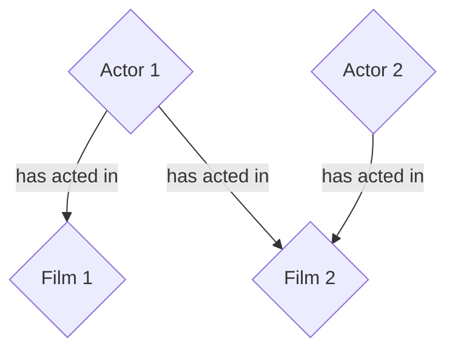

An example to understand the usage of Neo4J with a simple network graph:



## Neo4J

Local database started using:
https://hub.docker.com/_/neo4j

```
docker run --publish=7474:7474 --publish=7687:7687 --volume=C:\Users\subwa\neo4j\data:/data --env=NEO4J_AUTH=none neo4j
```

Then navigate to http://localhost:7474/browser/ for Cypher browser (authentication is disabled).

### Cheat sheet
- Delete all
```
match(n) detach delete n
```
- Delete node
```
match(p:Person {name: 'Jean Lethiec'}) delete p
```
- Update rel
```
match (p:Person {name: 'Jean Lethiec'})-[r:WORKS_FOR]->(c:Company) set r.startYear = '2019' return r
```
- Delete property (also works with set null)
```
match (n:Person {name: 'Jean Lethiec'})
remove n.birthdate
```
- Get or create node
```
merge (n:Person {name: 'Jean Lethiec'}) return n
```
- Get or create relationship (careful to have multiple match, and not match the whole pattern because that would generate duplicates)
```
match (j:Person {name: 'Jean Lethiec'})
match (m:Person {name: 'Naej Ceihtel'})
merge (j)-[r:IS_FRIENDS_WITH]->(m)
return j, r, m
```
- Consolidation
```
match (t:Technology)-[:LIKES]-(p:Person)
with t.type as technology, collect(p.name) as names
return technology, names
```
- An example of subquery
```
CALL {
	MATCH (p:Person)-[:LIKES]->(:Technology {type: "Java"})
	RETURN p

	UNION

	MATCH (p:Person)
	WHERE COUNT { (p)-[:IS_FRIENDS_WITH]->() } > 1
	RETURN p
}
WITH p,
     [(p)-[:LIKES]->(t) | t.type] AS technologies,
     [(p)-[:IS_FRIENDS_WITH]->(f) | f.name] AS friends

RETURN p.name AS person, p.birthdate AS dob, technologies, friends
ORDER BY dob DESC;
```

## Data processing
- We'll be using data from https://archive.ics.uci.edu/dataset/132/movie 
- Transform HTML data to CSV using https://www.convertcsv.com/html-table-to-csv.htm 
- Clean up the files, now available in this repository, and move them to `/var/lib/neo4j/import` in the neo4j container
```
cp /data/*.csv /var/lib/neo4j/import/
```
- Create constraint for actor uniqueness (name + period of work)
```
create constraint actor_unique for (a:Actor) require (a.name, a.work) is unique
```
- Load actors data
```
load csv with headers from "file:///actors.csv" as csvLine
create (:Actor {name: csvLine.stage, work: csvLine.dow, birth: csvLine.dob, death: csvLine.dod})
```
- Add index on actor name
```
create index for (a:Actor) on a.name
```
- Create constraint for movie uniqueness (title + date)
```
create constraint movie_unique for (m:Movie) require (m.title, m.date) is unique
```
- Load movies data (merge to remove duplicates)
```
load csv with headers from "file:///movies.csv" as csvLine
merge (:Movie {title: csvLine.title, date: csvLine.date})
```
- Add index on movie title
```
create index for (m:Movie) on m.title
```
- Load cast relationships
```
load csv with headers from "file:///casts.csv" as csvLine
match (m:Movie {title: csvLine.title})
match (a:Actor {name: csvLine.actor})
merge (a)-[:ACTED_IN]->(m)
```
